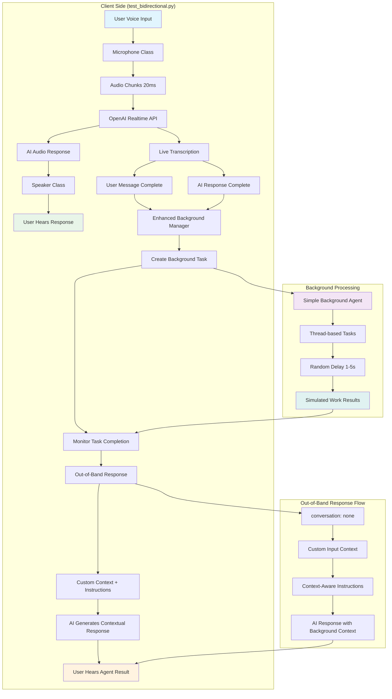
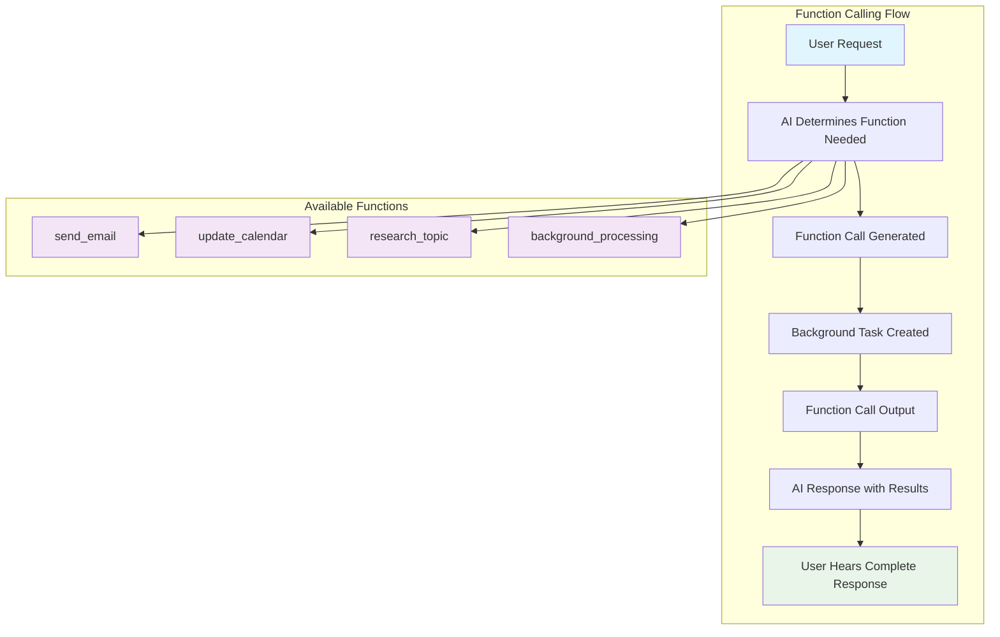

# Realtime API with Background Agent Integration

This project demonstrates a real-time bidirectional audio communication system that integrates OpenAI's Realtime API with background AI agents for complex task processing.

## Architecture Overview

### Approach 1: Out-of-Band Responses (Current Implementation)



### Approach 2: Function Calling (Alternative)



## Key Components

### 1. Real-time Audio Pipeline
- **Microphone**: Captures 24kHz PCM audio in 20ms chunks
- **Speaker**: Plays AI responses with <20ms latency
- **Interruption Handling**: User can interrupt AI mid-response

### 2. Background Agent Integration (Two Approaches)

#### Approach 1: Out-of-Band Responses (Current)
- **Always Invokes**: Every conversation turn triggers background processing
- **Out-of-Band Delivery**: Results delivered via `conversation: "none"` responses
- **Context Preservation**: Full conversation context maintained in custom input
- **Natural Integration**: AI generates contextual responses about background results

#### Approach 2: Function Calling (Alternative)
- **AI-Driven**: Model determines when to call background functions
- **Structured Functions**: Predefined functions for email, calendar, research
- **Automatic Handling**: Function calls automatically trigger background tasks
- **Seamless Flow**: Results integrated into natural conversation flow

### 3. Conversation Management
- **Turn-based Processing**: Complete user→AI pairs before agent invocation
- **Context Awareness**: Background results provide additional context
- **Error Recovery**: Graceful handling of agent failures
- **Memory Management**: Automatic cleanup of completed tasks

## Usage

```bash
# Install dependencies
pip install -r requirements.txt

# On macOS, install audio dependencies
brew install portaudio ffmpeg

# Grant microphone permissions to terminal
# Run the application
python test_bidirectional.py
```

## Background Agent Endpoint

The system expects a background agent at `http://localhost:8000/api/process` that:

1. Receives full conversation history
2. Performs background tasks (email, calendar, research)
3. Returns structured results
4. Handles timeouts gracefully

## Example Agent Response

```json
{
  "conversation_id": "conv_1234567890",
  "turn_id": "turn_5",
  "status": "completed",
  "results": [
    {
      "action": "email_sent",
      "recipient": "user@example.com",
      "subject": "Background task completed"
    },
    {
      "action": "calendar_updated",
      "summary": "Meeting scheduled",
      "time": "2024-01-15 14:00"
    }
  ],
  "timestamp": 1704067200.0
}
```

## Features

- ✅ Real-time bidirectional audio communication
- ✅ Background agent integration on every turn
- ✅ Complete conversation context preservation
- ✅ Automatic response delivery to user
- ✅ Robust error handling and timeouts
- ✅ LangSmith conversation tracking
- ✅ Interruption handling
- ✅ Live transcription display

## Architecture Benefits

1. **No Token Mixing**: Turn-based processing prevents user/AI token confusion
2. **Complete Context**: Background agents receive full conversation history
3. **Responsive UX**: Users get real-time feedback on background tasks
4. **Scalable**: Handles multiple concurrent conversations
5. **Fault Tolerant**: Graceful degradation on agent failures
